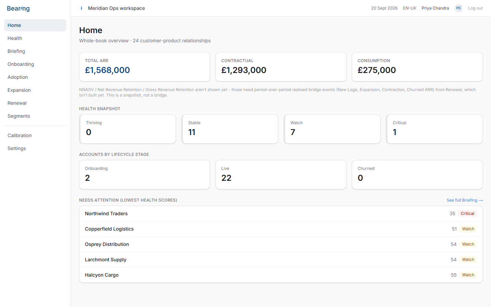
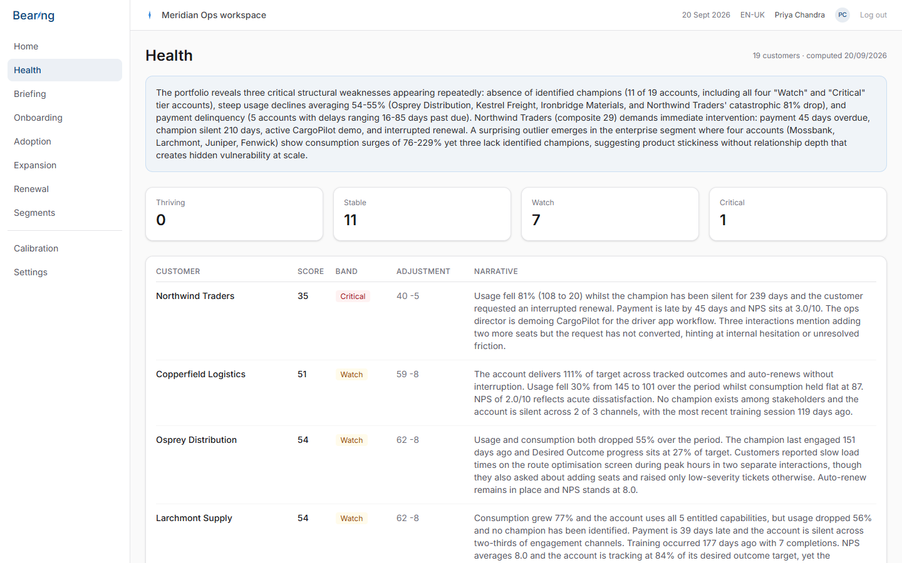
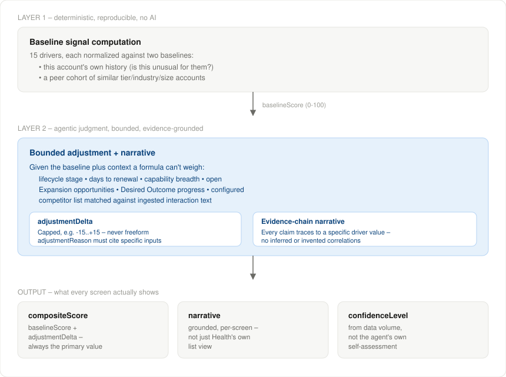
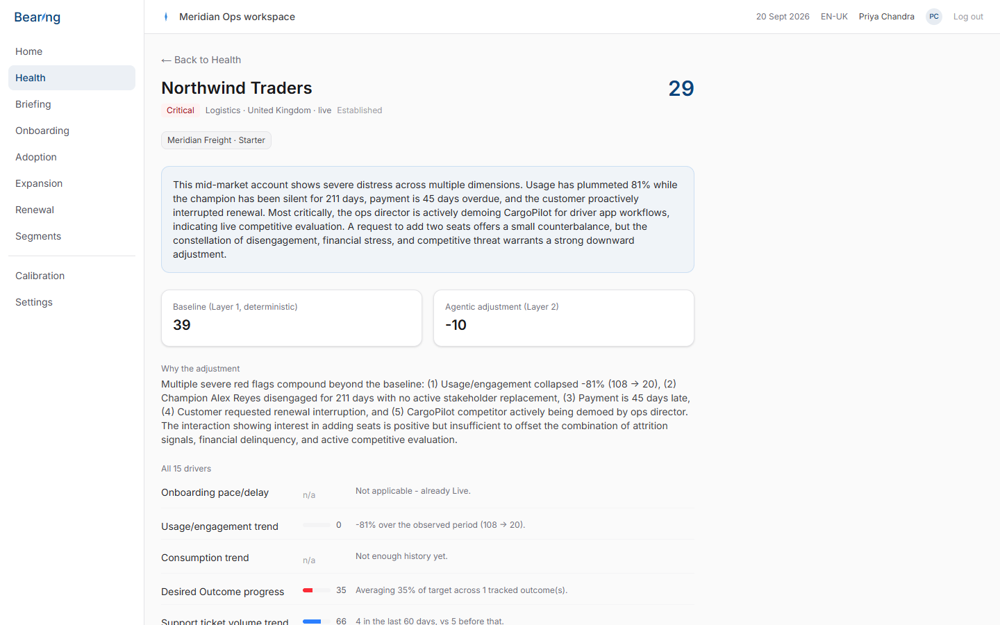
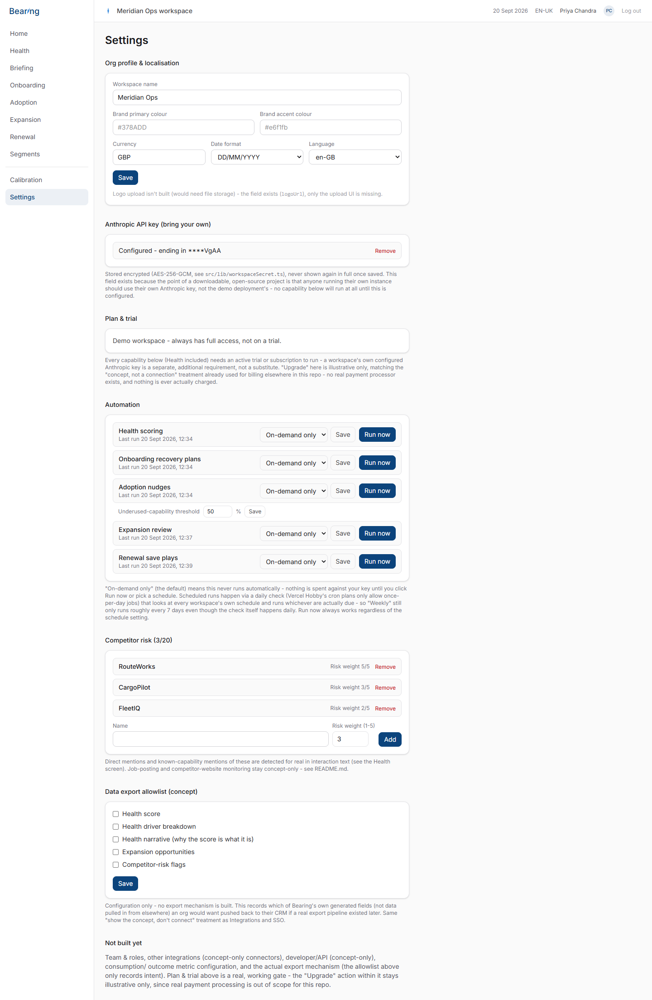
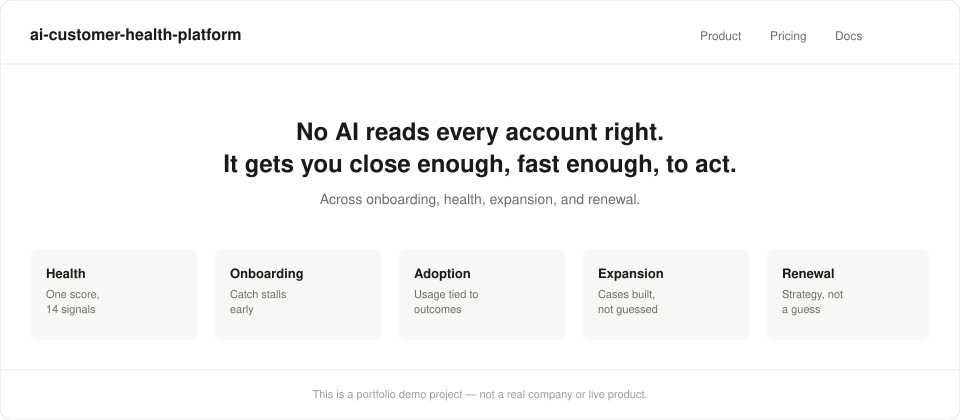

# ai-customer-health-platform

A conceptual exploration of an agentic-AI Customer Success platform – planned and built with Claude Code as a portfolio piece. **This is a prototype, not a production system, and not a real product.** Nothing here is a real company. There is no live *public* deployment (see [Stage 2](#stage-2-live-deployment-not-yet-started)), no real customer data anywhere, and no outbound contact beyond the Anthropic API itself.

> No AI reads every account right. It gets you close enough, fast enough, to act. Across onboarding, health, expansion, and renewal.








The four screenshots above are real captures of the actual running app, seeded with the synthetic data described below – not mockups. `health-scoring-architecture.svg` is a diagram, not a screenshot. `marketing-concept.svg` stays an illustrative mockup – no real landing/marketing page exists yet, see [What's real vs. planned](#whats-real-vs-planned) below.

The repo is named descriptively for portfolio discoverability; **"Bearing"** is the working product name used within the app and mockups themselves.

## What this is

Most Customer Success tooling is a system of record – a place to manage accounts, log interactions, and store contracts. This project is deliberately **not** that. It's an insight layer that sits on top of the systems that already do that job, organised around five areas of the customer lifecycle:

- **Health** – a composite score built from 15 drivers (support friction, consumption trend, capability breadth/stickiness, competitor risk, engagement silence, and more), run continuously from Onboarding through Live. The flagship area, and the one genuinely load-bearing piece of the whole idea.
- **Onboarding** – pace to first Capability go-live, with a cause-tagged log of any slippage.
- **Adoption** – usage and consumption trends per Capability, and progress against the Desired Outcomes a customer actually bought the product to achieve.
- **Expansion** – Price Increase, Cross-sell, Upsell, and Consumption Growth opportunities, each with a Raised-By and an Owner.
- **Renewal** – Auto vs. Interrupted renewals, ARR and consumption revenue at risk, and a projected-churn estimate shown honestly as an estimate, not a fact.

Every screen is meant to carry its own synthesized narrative, not just a data table – because a re-skinned CRM view isn't the point. If the reasoning underneath isn't genuinely sound, this whole idea doesn't hold up. See [Health scoring, and why it isn't built yet](#health-scoring-and-why-it-isnt-built-yet).

## Governing principle: safe by construction, not by promise

Every design decision in this repo follows one rule: **anything that would touch the outside world, real data, or a real compliance claim is shown as a concept only – never operationalized.**

- No real customer or personal data, anywhere, ever. All data is synthetic.
- No outbound network call except to the Anthropic API for the agent's own reasoning (and only once that's actually built – see below). Any other integration (a real CRM sync, a real email send, a real OAuth login, monitoring job boards or competitor websites) is represented as a UI concept, not a working connection, unless explicitly extended later with deliberate sign-off.
- No compliance claims that aren't true. No fabricated traction, testimonials, or results anywhere in this repo or its documentation.
- Every agent action is designed to be a draft a human reviews – nothing is ever sent or executed automatically.

## What's real vs. planned

All 9 screens (Home, Health, Briefing, Onboarding, Adoption, Expansion, Renewal, Segments, Settings) are wired to real data - nothing left as a static stub. They're not all equally deep, though - see the per-screen notes below for what's genuinely agentic vs. rule-based vs. read-only.

**This has actually been run, not just written.** See [`TESTING.md`](TESTING.md) for the log: real Anthropic API calls against handcrafted seed customers with known-good expected behaviour, a real cross-tenant security gap found and fixed, a real bug the multi-product data exposed, and an honest account of a browser-automation false negative during testing that turned out not to be a real bug.

| Area | Status |
|---|---|
| Product definition, requirements, information architecture | Fully planned |
| Data model (Workspace, User, Customer, Product, Capability, Package, Health snapshot, Competitor config, Interaction, Usage, Survey, Event attendance, Opportunity, Segment, Desired Outcome, Stakeholder, Training completion) | Built in `prisma/schema.prisma`, live on a real (free-tier) Postgres instance |
| App shell (navigation, layout, logo) | Built |
| Synthetic data generator (`prisma/seed.ts`) | **Built and run for real** - 19 fictional customers across 2 products, tickets, usage history, surveys, event attendance, renewal dates |
| Health-scoring engine (the actual "special sauce") | **Built and tested for real** - see below. Computed and stored for all 19 seeded customers via `prisma/compute-health-scores.ts` |
| `/health` | List view, per-customer drill-in (`/health/[customerId]`), and a real LLM-generated executive summary - all reading stored data, none recomputed on page load |
| `/` (Home) | Real Total ARR, Health bands, lifecycle-stage counts, and a "needs attention" list. Deliberately does not show NNAOV/NRR/GRR - those need realized bridge events this build doesn't track yet |
| `/onboarding` | Real three-date pace tracking and overdue sorting. No date-change event log or cause-tagging yet |
| `/adoption` | Real capability breadth and per-Capability adoption stats across live accounts |
| `/expansion` | Real Opportunity model (4 types), seeded by **deterministic rules**, not yet the same agentic reasoning as Health's Layer 2 |
| `/renewal` | Real renewal dates, Auto/Interrupted status, ARR at risk. Projected churn is a real calculation but explicitly labeled illustrative (reads off the Health band, not a calibrated model) |
| `/segments` | Real saved filters - create/view/delete all genuinely work, capped at 20 per workspace. Picking one from the top-bar selector re-scopes every area (Home, Health, Onboarding, Adoption, Expansion, Renewal, Briefing) to it, carried via the URL - the Micro view from the original design. Health's executive summary stays whole-book-only rather than generating a live per-segment Anthropic call on every page load |
| `/settings` | Org profile/branding/localisation and competitor risk config are real, writable forms (Server Actions). A data-export allowlist config is also real (which of Bearing's own generated fields would sync to a CRM), same concept-only treatment as Integrations/SSO - no actual export mechanism exists. Team & roles, billing, other integrations, developer/API stay honest "not built yet" |
| `/briefing` | Real cross-area action queue, consolidated by account and ranked by £ impact, pulled live from Health/Onboarding/Expansion/Renewal. Read-only - no approve/dismiss/snooze state yet |
| Agent core / playbooks for areas beyond Health | Expansion uses rule-based generation; the others are plain data views. A full agentic pass (matching Health's two-layer depth) is the natural next step, not done |
| Live public deployment | **Not started - deliberately.** See [Stage 2: live deployment](#stage-2-live-deployment-not-yet-started) |

## Health scoring – built, and how it actually works

The easy part of this project is the CRM-adjacent facts – ARR, package, who's assigned. Those aren't the point; a real CRM already shows them. The actual value has to come from genuine insight: a composite score that reasons about context rather than averaging numbers, and a narrative that explains *why*, built from evidence, not a template.

The architecture (see `docs/screenshots/health-scoring-architecture.svg`) is implemented in `src/lib/health/`:

- **Two layers, not one formula.** Layer 1 (`baseline.ts`) is deterministic and reproducible: each of the 15 drivers normalized against the account's own history and a peer cohort, not a fixed global threshold – no AI involved. Layer 2 (`agenticLayer.ts`) is a real Anthropic API call (`claude-sonnet-4-5`, structured tool output) that applies a **bounded** adjustment on top of the baseline (capped at +-15 points), with a required, evidence-grounded reason – never a freeform, unexplained number.
- **Evidence-chain narrative.** Every claim the narrative makes has to trace back to a specific input value it was given, not an invented correlation. Tested for real: the model has correctly cited exact usage-decline percentages, specific ticket dates and content, and even surfaced a genuine expansion signal ("asked about adding two more seats") that isn't one of the 15 formal drivers at all – reasoning beyond the baseline, not just restating it.
- **A real whole-book executive summary**, not a code-aggregated stat sentence. `src/lib/health/bookSummary.ts` makes one Anthropic call across all customers' scores and narratives, finding real cross-account patterns – tested for real, it independently spotted the same billing-sync defect recurring across four unrelated accounts, and noted that high-NPS accounts were nonetheless showing steep usage decline (sentiment lagging disengagement). Scoped by a list of customer IDs rather than hardcoded to "everyone," so the same function can serve a Segment-scoped summary later without changes. Computed by a batch script (`prisma/compute-book-summary.ts`), same "never live on page load" rule as everything else.
- **Stage-aware scoring.** A pre-Live account gets a narrow, honest read focused on onboarding pace, not the full 15-driver picture applied to an account that hasn't started yet.
- **Confidence labeling**, driven by how much data actually backs a score, not the agent's own self-assessment.
- **A calibration loop is designed but not yet built** – real outcomes tagged after the fact, surfaced periodically for a human to adjust weighting, not a silently self-tuning system. This is the one piece of the architecture still ahead of the code.

Two drivers worth calling out specifically, since they came from a skeptical pass on the model rather than an obvious first draft:

- **Competitor risk is multi-source, split on safety grounds.** Most churn is competitive displacement, not need disappearing, so a workspace admin can configure up to 20 competitors, each with a risk weight (not all competitors are equal threats – see `docs/screenshots/competitor-config-mockup.svg`; the seed data configures 3). Detection for **direct mentions** and **mentions of a competitor's known capabilities** is built for real, via the same Anthropic reasoning call used for Layer 2 – it only ever scans interaction text already in the system, so there's no new outbound contact and no dependency on a third-party product. Confirmed working against seeded ticket text (e.g. a mention of a competitor's predictive-ETA feature was correctly flagged with the supporting quote). Two further signal sources – **job postings** referencing a competitor's stack, and **references on a competitor's own website** – are deliberately **not implemented**. Both would require monitoring genuinely new external sources, which stays concept-only regardless of whether the competitor list is populated, pending explicit sign-off.
- **Engagement silence.** A noisy, complaining customer is easy to spot; a silent one – no support contact, no event attendance, flat usage, no communication – is often the bigger risk, and a naive per-driver model can actually score a quiet account as *healthier* than it should be, since fewer tickets alone looks like an improvement. This driver checks for sustained absence across multiple channels at once, and is confirmed (via the handcrafted "Silent Freight Ltd" seed customer) to override a falsely-reassuring "quiet = good" reading rather than just sit alongside it.

**A small but real fix worth naming:** Claude's prose defaults to em dashes fairly often, and this repo holds a strict no-em-dash style rule throughout, including AI-generated text. `src/lib/text.ts` sanitizes every stored narrative/summary; found and fixed after the fact for the handful of records generated before the fix existed.

**All 15 drivers now have real data behind them (2026-08-16).** Desired Outcome progress, stakeholder/champion engagement, training consumption, and payment/billing health were the last four - each still returns `null` honestly for a specific account with no data of that kind (a customer with no Desired Outcome tracked, no identified champion, no training booked), but the underlying models (`DesiredOutcome`, `Stakeholder`, `TrainingCompletion`, plus `paymentStatus`/`daysPastDue` on `CustomerProduct`) are real and seeded. Confirmed working end-to-end: the whole-book summary independently picked up "champion disengagement... directly correlated with interrupted renewals" across the seeded cohort and cited a specific account's exact 45-day-late payment, without either signal being prompted for by name.

A real bug did surface during an earlier skeptical pass over the repo: the tool schema marks `narrative` "required", but that only forces the field to exist, not to be non-empty, and one customer's narrative came back as an empty string while `adjustmentReason` still held real, grounded reasoning. Fixed with a fallback (`agenticLayer.ts` now falls back to `adjustmentReason`, and throws rather than silently storing nothing if both are empty) and re-run for that customer.

## Stage 2: live deployment – not yet started

There is no public URL and no live deployment. The database and Anthropic API key that exist are Dan's own free-tier, spend-capped, local-only credentials (`.env`, gitignored) – nobody else can reach this. A real public deployment is a deliberate future step, gated on:

1. ~~The Health-scoring engine actually being implemented~~ – **done** (see above).
2. Rate limiting and usage caps being in place, so a public sign-up flow can't run up hosting or API costs.
3. A hard spending cap set on the Anthropic API account *before* any real key is wired into a public-facing deployment.
4. ~~The other 8 screens reaching real data, not static stubs~~ – **done** (see the table above) - though most are still rule-based or read-only rather than the same agentic depth as Health, which is its own remaining gap, separate from this gate.
5. Real auth - there currently isn't any. Anyone with the URL sees everything, which is fine for a local-only build and not acceptable for anything public.

## Tech stack

Next.js (App Router) + TypeScript, Tailwind CSS, Inter (Google Fonts, open-licensed), Prisma (pinned to v6 for its simpler schema-only datasource config) on Postgres (Neon free tier), Anthropic API for Layer 2 reasoning. Auth (when built) will be email/password only – no third-party OAuth, so no real identity provider is ever contacted. Both the database and the Anthropic key are free-tier/spend-capped with no payment method attached, and are local-only credentials, not deployed anywhere public.

## Running it locally

```
npm install
```

Create a `.env` file (copy `.env.example`) with your own `DATABASE_URL` (a free Neon/Supabase Postgres instance) and `ANTHROPIC_API_KEY` (spend-capped). Then:

```
npx prisma db push
npx tsx prisma/seed.ts
npx tsx prisma/seed-renewal-dates.ts
npx tsx prisma/compute-health-scores.ts
npx tsx prisma/compute-book-summary.ts
npx tsx prisma/generate-opportunities.ts
npm run dev
```

Opens at `http://localhost:3000`. Every screen reads real, seeded/computed data - start at `/health` for the deepest one (full driver breakdown per customer at `/health/[customerId]`, real LLM-generated executive summary), or `/briefing` for the consolidated cross-area view.

## License

MIT – see [LICENSE](LICENSE).
